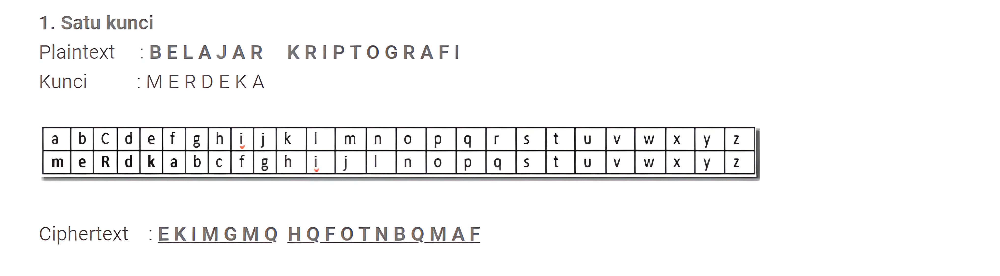
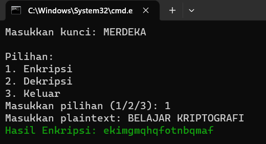
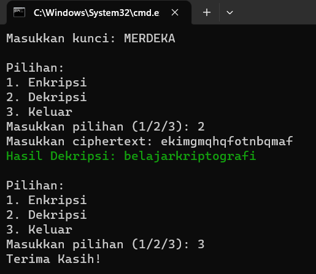

# Tugas Kriptografi
## Profil
**_
Nama: Delfian Ruly Havatilla
_**
**_
Kelas: TI.21.A.1
_**
**_
Nim: 312110161
_**

## Encryption Polyalphabetic Cipher

 Kriptografi polyalphabetic merupakan improvisasi dari teknik substitusi monoalphabetic. Polyalphabetic substitution chiper melakukan teknik kriptografi monoalphabetic satu kali proses untuk suatu plainteks pesan.  Algoritma polyalphabetic cipher membuat ciperteks lebih kuat untuk dapat dipecahkan karena karakter plainteks yang sama tidak dienkripsi dengan cipherteks yang sama. Kunci enkripsi polyalphabetic cipher dapat berbeda sehingga mempunyai kemungkinan kombinasi yang lebih bervariasi dan lebih sulit dipecahkan. Metode Vigenere cipher menjadi dasar dari polyalphabetic substitution cipher.

### Cara Kerja

Polyalphabetic merupakan penyandian yang dilakukan dengan mengelompokkan beberapa huruf menjadi sebuah kesatuan dan kemudian dienkripsi. Pada cipher ini, menggunakan beberapa alfabet kemudian ditulis disebuah tabel. Polyalphabetic cipher menggunakan cipher abjad-tunggal yang masing-masing dengan kunci berbeda.

## Output

- Encrypt

- Decrypt

## Terima Kasih!